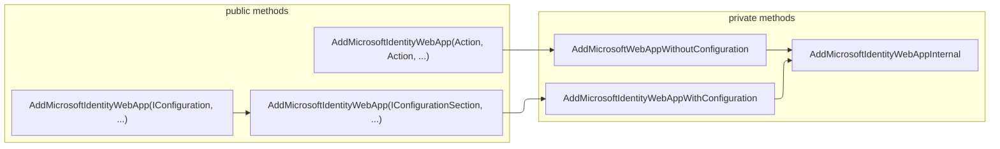

`MicrosoftIdentityWebAppAuthenticationBuilderExtensions`には`AddMicrosoftIdentityWebApp`という名前の`AuthenticationBuilder`の拡張メソッドが3つあります。

[MicrosoftIdentityWebAppAuthenticationBuilderExtensions.AddMicrosoftIdentityWebApp Method (Microsoft.Identity.Web) - Microsoft Authentication Library for .NET &#124; Microsoft Learn](https://learn.microsoft.com/ja-jp/dotnet/api/microsoft.identity.web.microsoftidentitywebappauthenticationbuilderextensions.addmicrosoftidentitywebapp?view=msal-model-dotnet-latest)

違いがわからなかったので少し整理してみました。

- 1つ目と2つ目は設定情報を`IConfigurationSection`または`IConfiguration`で渡す方法
- 3つ目は`Action<MicrosoftIdentityOptions>`と`Action<CookieAuthenticationOptions>`でオプションを設定する方法

```cs
// 1
// IConfigurationSectionを受け取る
public static MicrosoftIdentityWebAppAuthenticationBuilderWithConfiguration AddMicrosoftIdentityWebApp(
    this AuthenticationBuilder builder,
    IConfigurationSection configurationSection,
    string openIdConnectScheme = "OpenIdConnect",
    string? cookieScheme = "Cookies",
    bool subscribeToOpenIdConnectMiddlewareDiagnosticsEvents = false,
    string? displayName = default);
    // 内部で
    // AddMicrosoftIdentityWebAppWithConfiguration（privateメソッド）
    // を呼び出している

// 2
// IConfigurationを受け取る
public static MicrosoftIdentityWebAppAuthenticationBuilderWithConfiguration AddMicrosoftIdentityWebApp(
    this AuthenticationBuilder builder,
    IConfiguration configuration,
    string configSectionName = "AzureAd",
    string openIdConnectScheme = "OpenIdConnect",
    string? cookieScheme = "Cookies",
    bool subscribeToOpenIdConnectMiddlewareDiagnosticsEvents = false,
    string? displayName = default);
    // 内部では1のメソッドを呼び出している

// 3
// オプションをActionで設定する
public static MicrosoftIdentityWebAppAuthenticationBuilder AddMicrosoftIdentityWebApp(
    this AuthenticationBuilder builder,
    Action<MicrosoftIdentityOptions> configureMicrosoftIdentityOptions,
    Action<CookieAuthenticationOptions>? configureCookieAuthenticationOptions = default,
    string openIdConnectScheme = "OpenIdConnect",
    string? cookieScheme = "Cookies",
    bool subscribeToOpenIdConnectMiddlewareDiagnosticsEvents = false,
    string? displayName = default);
    // 内部で
    // AddMicrosoftWebAppWithoutConfiguration（privateメソッド）
    // を呼び出している
```

ここからは上記から呼び出されるプライベートメソッドたち。

```csharp
// 1から呼び出される
private static MicrosoftIdentityWebAppAuthenticationBuilderWithConfiguration AddMicrosoftIdentityWebAppWithConfiguration(
    this AuthenticationBuilder builder,
    Action<MicrosoftIdentityOptions> configureMicrosoftIdentityOptions,
    Action<CookieAuthenticationOptions>? configureCookieAuthenticationOptions,
    string openIdConnectScheme,
    string? cookieScheme,
    bool subscribeToOpenIdConnectMiddlewareDiagnosticsEvents,
    string? displayName,
    IConfigurationSection configurationSection);
    // 内部で
    // AddMicrosoftIdentityWebAppInternal（privateメソッド）
    // を呼び出す

// 3から呼び出される
private static MicrosoftIdentityWebAppAuthenticationBuilder AddMicrosoftWebAppWithoutConfiguration(
    this AuthenticationBuilder builder,
    Action<MicrosoftIdentityOptions> configureMicrosoftIdentityOptions,
    Action<CookieAuthenticationOptions>? configureCookieAuthenticationOptions,
    string openIdConnectScheme,
    string? cookieScheme,
    bool subscribeToOpenIdConnectMiddlewareDiagnosticsEvents,
    string? displayName);
    // 内部で
    // AddMicrosoftIdentityWebAppInternal（privateメソッド）
    // を呼び出す

// 最終的に呼び出される
private static void AddMicrosoftIdentityWebAppInternal(
    AuthenticationBuilder builder,
    Action<MicrosoftIdentityOptions> configureMicrosoftIdentityOptions,
    Action<CookieAuthenticationOptions>? configureCookieAuthenticationOptions,
    string openIdConnectScheme,
    string? cookieScheme,
    bool subscribeToOpenIdConnectMiddlewareDiagnosticsEvents,
    string? displayName);
```

ソースコードはこちら。

[microsoft-identity-web/src/Microsoft.Identity.Web/WebAppExtensions/MicrosoftIdentityWebAppAuthenticationBuilderExtensions.cs at master · AzureAD/microsoft-identity-web](https://github.com/AzureAD/microsoft-identity-web/blob/master/src/Microsoft.Identity.Web/WebAppExtensions/MicrosoftIdentityWebAppAuthenticationBuilderExtensions.cs)

コードを追っていると最終的には`AddMicrosoftIdentityWebAppInternal`という内部メソッドを呼んでいることがわかりました。

図にしてみる次のような流れです。



`AddMicrosoftWebAppWithoutConfiguration`メソッド名に`Identity`が抜けているように思いましたが、何か意図があるのかそこまではまだ分からず。
